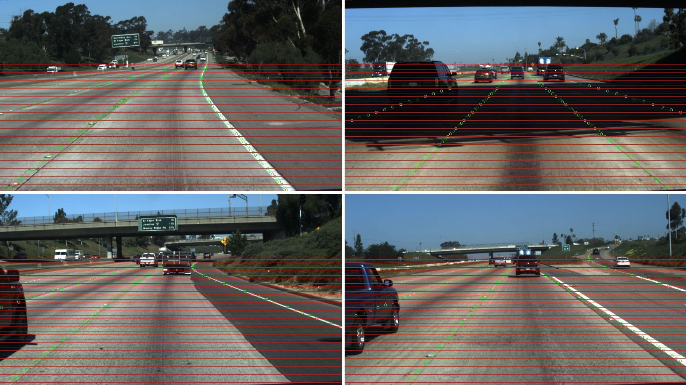

# TuSimple Lane Detection Challenge



## Description
The lane marking is the main component on the highway. It instructs the vehicles interactively and safely drive on the highway. Lane detection is a critical task in autonomous driving, which provides localization information to the control of the car. We provide video clips for this task, and the last frame of each clip contains labelled lanes. The video clip can help algorithms to infer better lane detection results.

## Dataset Size
2858 video clips, 2858 labelled frames.
Information of each clip: 20 frames for each one.

## Directory Structure:
   	dataset
   		|
   		|----clips/ 					# video clips, 2858 clips
   		|------|
   		|------|----some_clip/			# Sequential images for the clip, 20 frames
   		|------|----...
   		|
   		|----label_data.json			# Label data for lanes

## Label Data Format
Each json line in 'label_data.json' is the label data for __the last (20th) frame__ of some clip.

__Format__

```
    {
     	'raw_file': str. Clip file path.
     	'lanes': list. A list of four lanes - [inner_left_lane, inner_right_lane, outer_left_lane, outer_right_lane].
	     	for each list of one lane, the elements are width values on image.
     	'h_samples': list. A list of height values corresponding to the 'lanes', which means len(h_samples) == len(lanes[i])
    }
```
The four polylines are orgnized by the same distance gap ('h_sample' in each label data) from the recording car. It means you can pair each element in one lane and h_samples to get position of lane marking on images.

For example,
```
{
	"lanes": [
				[-100, -100, -100, -100, 632, 625, 617, 609, 601, 594, 586, 578, 570, 563, 555, 547, 539, 532, 524, 516, 508, 501, 493, 485, 477, 469, 462, 454, 446, 438, 431, 423, 415, 407, 400, 392, 384, 376, 369, 361, 353, 345, 338, 330, 322, 314, 307, 299],
				[-100, -100, -100, -100, 719, 734, 748, 762, 777, 791, 805, 820, 834, 848, 863, 877, 891, 906, 920, 934, 949, 963, 978, 992, 1006, 1021, 1035, 1049, 1064, 1078, 1092, 1107, 1121, 1135, 1150, 1164, 1178, 1193, 1207, 1221, 1236, 1250, 1265, -100, -100, -100, -100, -100],
				[-100, -100, -100, -100, -100, 532, 503, 474, 445, 416, 387, 358, 329, 300, 271, 241, 212, 183, 154, 125, 96, 67, 38, 9, -100, -100, -100, -100, -100, -100, -100, -100, -100, -100, -100, -100, -100, -100, -100, -100, -100, -100, -100, -100, -100, -100, -100, -100],
				[-100, -100, -100, 781, 822, 862, 903, 944, 984, 1025, 1066, 1107, 1147, 1188, 1229, 1269, -100, -100, -100, -100, -100, -100, -100, -100, -100, -100, -100, -100, -100, -100, -100, -100, -100, -100, -100, -100, -100, -100, -100, -100, -100, -100, -100, -100, -100, -100, -100, -100]
			 ],
	"h_samples": [240, 250, 260, 270, 280, 290, 300, 310, 320, 330, 340, 350, 360, 370, 380, 390, 400, 410, 420, 430, 440, 450, 460, 470, 480, 490, 500, 510, 520, 530, 540, 550, 560, 570, 580, 590, 600, 610, 620, 630, 640, 650, 660, 670, 680, 690, 700, 710],
	"raw_file": "path_to_clip"
}
```
`-100` in `lanes` means on some h_sample, there is no existing lane marking. The first existing point in the first lane is `(632, 240)`.

## Evaluation:
For each prediction of a clip, organize the result with the same format of label data. Also, you need to output a same `h_samples` in the results for evaluation. It means we are going to evaluation points of specified image heights.

__Format__

```
{
	'raw_file': str. Clip file path
	'lanes': list. A list of four lanes - [inner_left_lane, inner_right_lane, outer_left_lane, outer_right_lane].
			 for each list of one lane, there is only width index on the image.
	'h_samples': list. Same with requested `h_samples`in some evaluation dataset.
}
```
The list of four lanes contains semantic meaning, positions compared to the car. We encourage you to predict lanes with the same semantic order, however, we do not evaluate the order nowadays. You can put the most confident four lines of lane markings in a list with any order as the value of 'lanes'.

The evaluation formula:
<a href="https://www.codecogs.com/eqnedit.php?latex=\inline&space;$$\frac{\sum_{clip}&space;C_{clip}}{\sum_{clip}&space;S_{clip}}$$" target="_blank"></a>
where
<a href="https://www.codecogs.com/eqnedit.php?latex=\inline&space;$C_{clip}$" target="_blank"></a>
 is the number of correct points in the last frame of the `clip`,
<a href="https://www.codecogs.com/eqnedit.php?latex=\inline&space;$S_{clip}$" target="_blank"></a>
 is the number of requested points in the last frame of the `clip`. If the difference between the width of ground-truth and prediction is less than a threshold, the predicted point is a correct one. If you some point is out of view or there is no lane markings of some specific `h_sample`, just record the detection as `-100`. We will evaluate the values of all heights in `h_sample`.

We do not release testing dataset at present, you can split the label data to training/validation/testing datasets. You are supposed to predict 'lanes' according to specified 'h_samples'.
