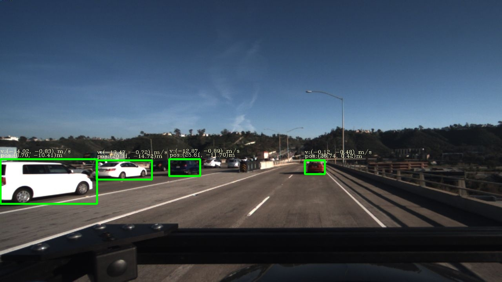

# VELOCITY ESTIMATION DATASET FROM TUSIMPLE 



## Task Description
For each test sequence, predict the planar velocity and position of certain vehicles relative to the camera on a specific frame given. All the velocity and displacement on the vertical direction is ignored in this dataset. The output from your system should be a 2d vector representing the velocity vector, and a 2d coordinate in meters representing the closest point of the vehicle to the camera for each vehicle. The output should be formatted similarly with the ground truth given, whose format will be defined in the following section.

## Size 
246 training clips, each containing 60 frames of 30fps video.

## Directory Structure:
      |
      |----readme.md              # description
      |
      |----calibration.txt                # intrinsic parameters of the camera used
      |
      |----clips/               # 246 video clips
      |------|----...
      |------|----some_clip/          # images and json labels for each clip
      |------|--------|
      |------|--------|----imgs/          # 60 frames of 30 fps video recorded, 2 seconds in total
      |------|--------|
      |------|--------|----annotation.json    # json annotation of designated vehicles.
      |------|----...

## Label Data Format

 - calibration.txt: a text file containing the intrinsic parameters of the camera used, structured in a 3*3 matrix and the camera height to the ground.

Each of the training clip can be found under a clip folder named in 3 digits.
The files in the folder are structured as follows:
 - img/:  subfolder contains 60 frames of images recorded at 30 fps, the end of the which, 060.jpg, is the frame that ground truth annotation on, and the frame that needs to estimate velocity on.
 - annotation.json: a json file, containing the ground truth velocity and position for designated vehicles.  

And the ground truth json file is structured as follows:
```
{ 
   [vehicle]: an array of [vehicle], defining the velocity and position of each vehicle in the image.
}

vehicle:
{
  "bbox": a json structure with 4 fields 'top','left','bottom','right': The axis-aligned rectangle specifying the extent of the vehicle in the image.
  "velocity": a float pair [x,y]. Relative planar velocity of the vehicle in meters per second. x direction is the same with the camera optical axis and y direction is vertical to x and towards right.
  "position": a float pair [x,y]. Planar position of the nearest point on vehicle in meters. x direction is the same with the camera optical axis, and y direction is vertical to x and towards right.
}
```

## Evaluation Protocal
The metric we use in evaluating velocity estimation is Mean Squared Velocity Error:


with  denotes the set of submitted results for each vehicle,  represents the ground truth velocity for a certain vehicle, and  represents the estimated velocity for such vehicle. Similarly, we use Mean Squared Position Error to evaluate position esitimation: 


 represents the ground truth position of the nearest point on a certain vehicle, and  represents the estimated position of the nearest point on such vehicle.

We classifiy test vehicles by its relative distance to the camera into three classes: Near(0-15m), Medium(15-40m), and Far(40m+). We evaluate the performance seperately, and average them together to get the final evaluation score.

We have not released test dataset at this point, you can split the label data to training/validation/testing datasets. You are supposed to predict 'velocity' and 'position' according to specified 'bbox' on a given image sequence.